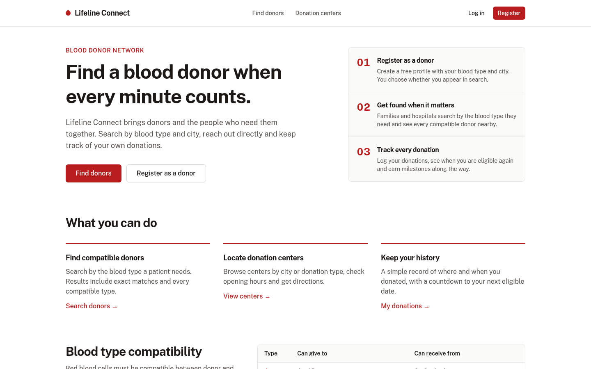
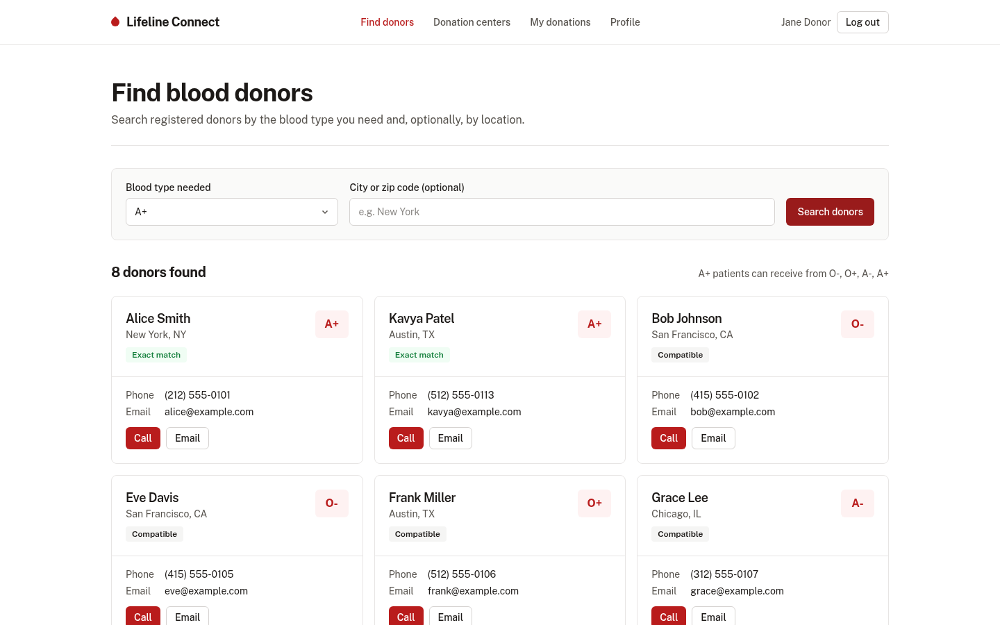
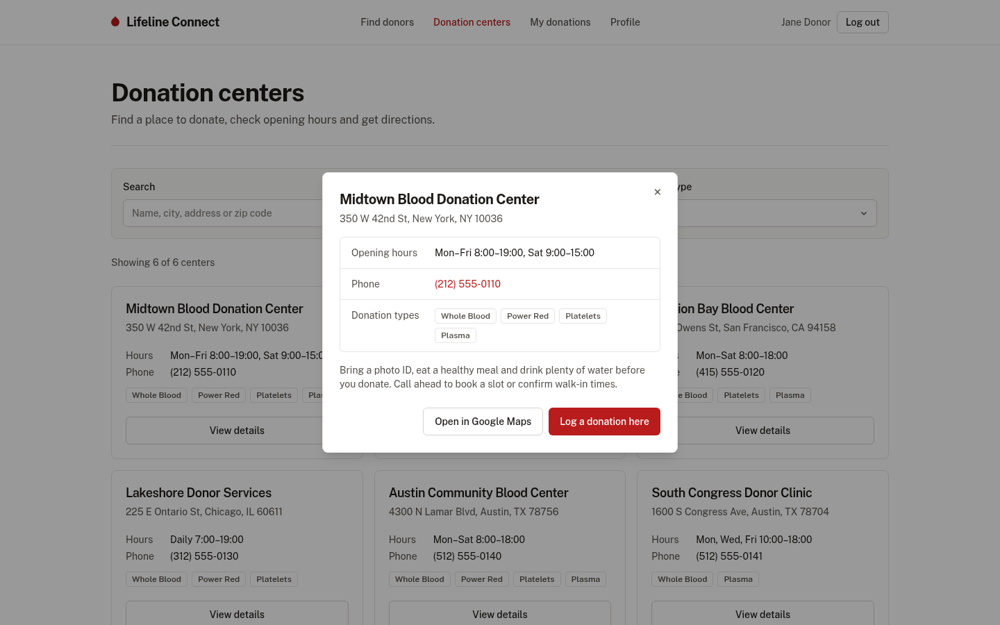
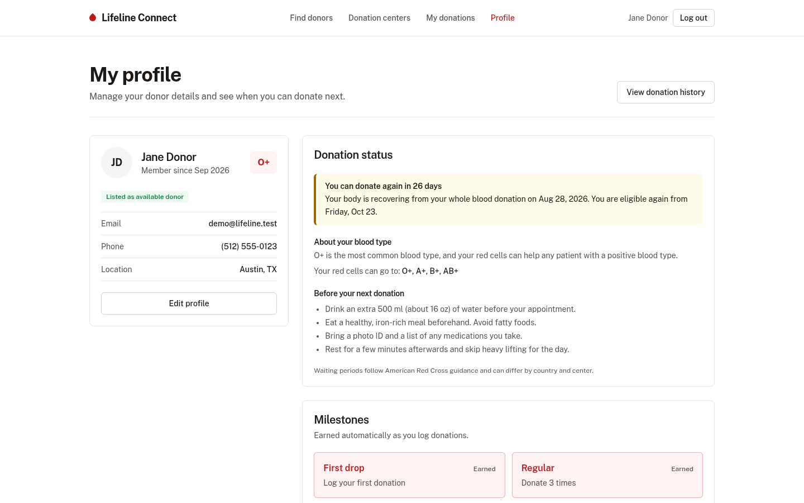
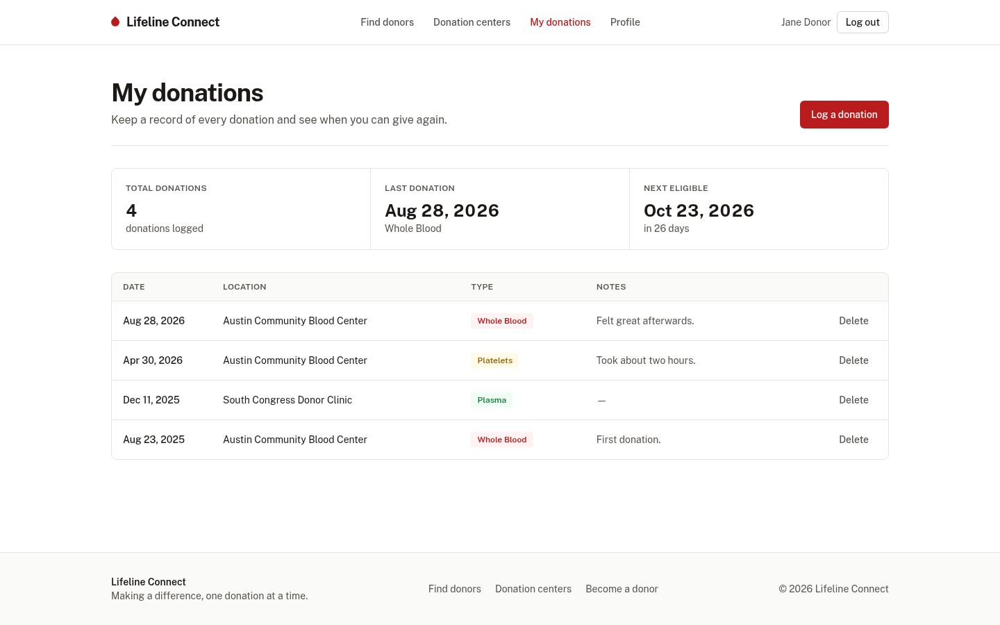
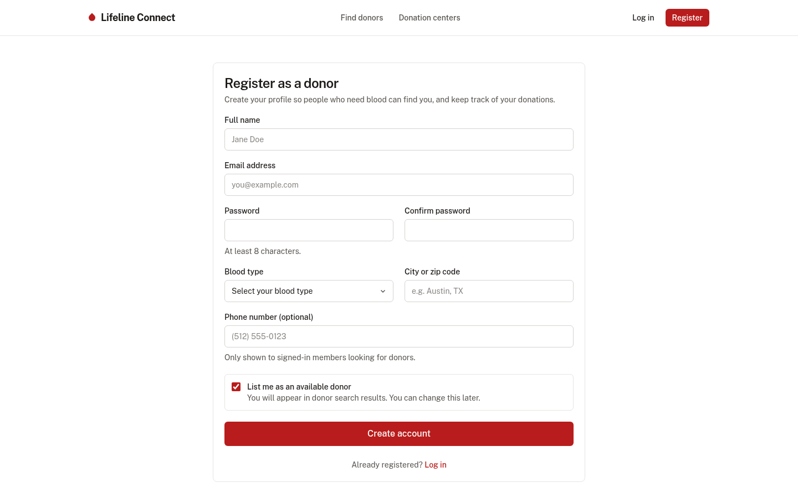
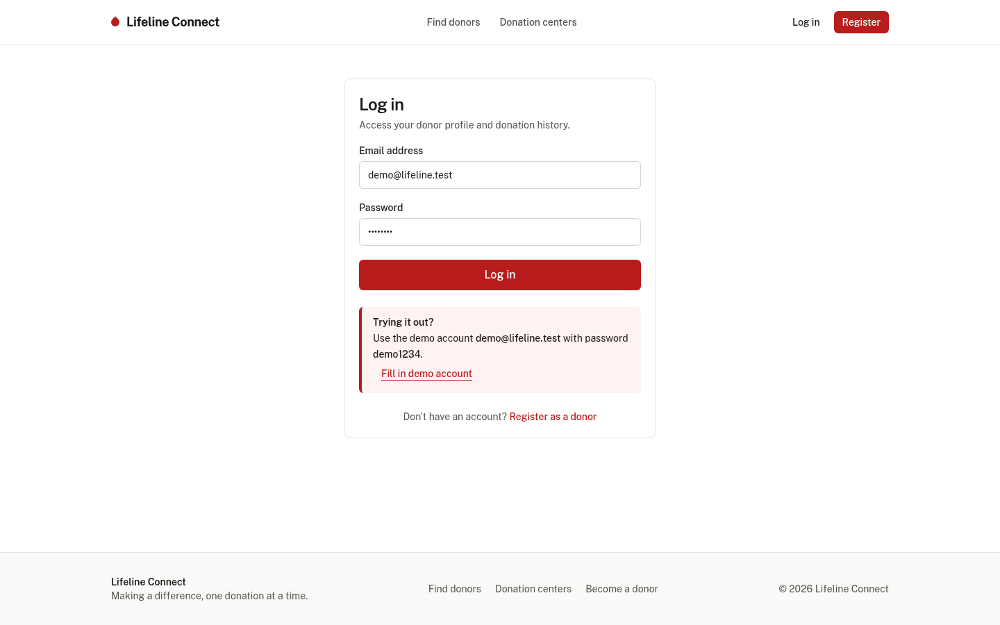

# Life Line Connect

A web app that connects blood donors with the people who need them. Search for compatible donors by blood type and city, find donation centers, and keep track of your own donations.



---

## Features

- **Donor registration and login.** Create a donor profile with your blood type, city and phone number, and choose whether you appear in search.
- **Compatible donor search.** Pick the blood type a patient needs and see every available donor whose blood is compatible, with exact matches first. You can filter by city or zip code. Contact details are only shown to signed-in members.
- **Donation centers.** Browse centers by name, city or donation type, see opening hours, and open directions in Google Maps.
- **Donation history.** Log and delete donations, and see your total, your last donation and the date you can donate again.
- **Profile.** Edit your details, check your donation eligibility, read tips for your blood type and earn milestones as you donate.
- **Responsive.** Works on mobile and desktop.

## Demo account

Log in with **demo@lifeline.test** / **demo1234**, or click "Fill in demo account" on the login page.

## Screenshots

| Find donors | Donation centers |
| --- | --- |
|  |  |

| Profile | Donation history |
| --- | --- |
|  |  |

| Register | Log in |
| --- | --- |
|  |  |

---

## Tech stack

- **Next.js 15** (App Router) and **React 19**
- **TypeScript**
- **Tailwind CSS 4**
- **React Hook Form** and **Zod** for forms and validation
- **Radix UI** primitives for the dialog, label and slot
- **date-fns** for dates and **Sonner** for notifications

### How data is stored

This MVP has no backend. Accounts, donations and the login session are saved in the browser's `localStorage`, and a set of sample donors is created on first visit. Passwords are stored as salted SHA-256 hashes, but because everything stays on the client this is not production-grade security. All data access goes through `src/lib/store.ts`, so that one module can be replaced with a real API or database later.

To reset the demo data, clear the site's local storage in your browser's developer tools.

---

## Getting started

Requirements: Node.js 18.18 or newer.

```bash
git clone https://github.com/Sutharmanish09/Life_Line_Connect.git
cd Life_Line_Connect
npm install
npm run dev
```

The app runs at http://localhost:3000.

Other scripts:

```bash
npm run build      # production build (includes type checking)
npm start          # serve the production build
npm run typecheck  # type check only
```

## Project structure

```
src/
  app/                 Pages (home, search, centers, donations, profile, login, register)
  components/
    features/          Page sections such as donor cards, donation table and profile cards
    forms/             Login, registration, search, donation and profile forms
    layout/            Header, footer and page header
    modals/            Donation center details dialog
    ui/                Buttons, inputs, cards, dialog and other primitives
  lib/
    store.ts           localStorage data store, auth and queries
    blood.ts           Blood type compatibility, donation intervals and milestones
    centers.ts         Donation center data
    seed.ts            Sample donors and the demo account
  types/               Shared TypeScript types
```

## Future improvements

- A real backend and database, with proper authentication
- Notifications and alerts for urgent requests
- Messaging between donors and recipients
- An admin panel to verify donors and manage centers
- A map view and distance-based matching

## License

Released under the [Apache License 2.0](LICENSE).

## Contact

- Email: [your-email@example.com]
- Portfolio: https://bento.me/manishsuthar
- GitHub: [Sutharmanish09](https://github.com/Sutharmanish09)
- LinkedIn: Manish Suthar
